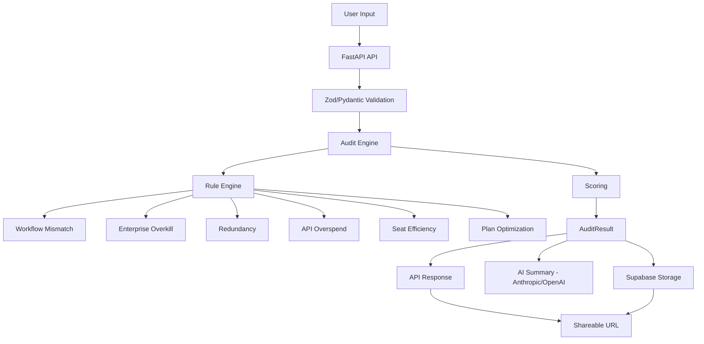

# Architecture

## Overview

AIRev is an AI tool spending auditor that analyzes a team's AI tool stack and identifies overspend, redundancy, and misalignment. It runs as a Python FastAPI backend with a rule-based engine, persists results to Supabase (PostgreSQL), and optionally generates AI-powered narrative summaries via Anthropic or OpenAI.

---

## System Diagram



---

## Data Flow

1. **Input**: User submits team size, primary use case, and a list of AI tools with plan/spend details via `POST /api/audit`.
2. **Validation**: Pydantic models (`AuditInput`, `ToolUsage`) validate and normalize the input. Invalid requests get a `422` response.
3. **Rule Evaluation**: Each tool is passed through every rule module in `app/engine/rules/`. Each rule returns a `Recommendation | None`.
4. **Scoring**: All recommendations are aggregated. An overspend score (0–100) is computed based on weighted rule contributions.
5. **Result Assembly**: The `AuditResult` is assembled with recommendations, score breakdown, and savings calculations.
6. **Persistence**: The result (as JSON) is stored in Supabase with a unique `public_id` for shareable URLs.
7. **Summary** (optional): The result is sent to Anthropic Claude or OpenAI GPT-4 for a narrative executive summary.
8. **Response**: The full `AuditResult` is returned to the client.

---

## Stack Justification

| Component | Choice | Why |
|-----------|--------|-----|
| **Language** | Python 3.11+ | Rich ecosystem for data processing, fast prototyping, strong typing with modern type hints |
| **Framework** | FastAPI | Async-ready, automatic OpenAPI docs, Pydantic-native validation, excellent for API-first products |
| **Database** | Supabase (PostgreSQL) | Free tier for MVP, managed Postgres, built-in auth/storage if needed later, easy migration path |
| **AI Summaries** | Anthropic Claude / OpenAI GPT-4 | Best-in-class writing quality; Claude for primary, GPT as fallback |
| **Email** | Resend | Developer-friendly API, generous free tier, good deliverability |
| **CI** | GitHub Actions | Free for public repos, simple YAML config, tight GitHub integration |
| **Linting** | Ruff | Extremely fast, replaces flake8 + isort + pyupgrade in one tool |

---

## Rule Engine Design

Each rule is an independent Python module in `app/engine/rules/` with a consistent interface:

```python
RULE_NAME: str = "rule_name"
RULE_WEIGHT: float = 0.2  # contribution to overspend score

def evaluate(
    tool: ToolUsage,
    team_size: int,
    primary_use_case: UseCase,
    all_tools: list[ToolUsage],
) -> Recommendation | None:
    ...
```

**Why this design:**
- **Independent modules**: Each rule can be tested in isolation.
- **Consistent interface**: New rules can be added without touching the engine core.
- **Weight-based scoring**: Rules contribute proportionally to the final score, making tuning straightforward.
- **`all_tools` parameter**: Enables cross-tool analysis (redundancy detection) without global state.

### Current Rules

| Rule | Weight | What It Detects |
|------|--------|-----------------|
| `workflow_mismatch` | 0.15 | Tool doesn't match team's primary use case |
| `enterprise_overkill` | 0.25 | Small team overpaying for enterprise features |
| `redundancy` | 0.25 | Multiple tools serving the same function |
| `api_overspend` | 0.20 | Disproportionate per-developer API spending |
| `seat_efficiency` | 0.10 | Paying for more seats than team members |
| `plan_optimization` | 0.05 | Better plan available at current usage level |

---

## Directory Structure

```
airev/
├── app/
│   ├── __init__.py
│   ├── main.py              # FastAPI app, routes
│   ├── config.py             # Settings via environment variables
│   ├── schemas.py            # Pydantic models (AuditInput, AuditResult, etc.)
│   └── engine/
│       ├── __init__.py       # run_audit() entry point
│       ├── scoring.py        # Overspend score calculation
│       ├── pricing.py        # Hardcoded pricing data
│       └── rules/
│           ├── __init__.py
│           ├── workflow_mismatch.py
│           ├── enterprise_overkill.py
│           ├── redundancy.py
│           ├── api_overspend.py
│           ├── seat_efficiency.py
│           └── plan_optimization.py
├── tests/
│   ├── conftest.py
│   ├── test_workflow_mismatch.py
│   ├── test_enterprise_overkill.py
│   ├── test_redundancy.py
│   ├── test_api_overspend.py
│   ├── test_savings_calculation.py
│   ├── test_audit_engine.py
│   └── test_api.py
├── supabase/
│   └── migrations/
│       └── 001_initial_schema.sql
└── .github/
    └── workflows/
        └── ci.yml
```

---

## Scaling Discussion

### Current State (MVP)

- Single FastAPI process behind Uvicorn
- Synchronous rule evaluation (~10ms per audit)
- Supabase free tier (500MB, sufficient for 100K+ audits)

### 1K–10K Audits/Day

- Add Gunicorn with multiple Uvicorn workers
- Consider caching pricing data in memory (already the case)
- AI summary generation is the bottleneck — make it async with background tasks

### 10K–100K Audits/Day

- Move to a managed container service (Railway, Fly.io, or AWS ECS)
- Add Redis for rate limiting and caching
- Consider pre-computing common audit patterns
- Upgrade Supabase tier or migrate to managed PostgreSQL (RDS/Cloud SQL)

### 100K+ Audits/Day

- Horizontal scaling with load balancer
- Separate AI summary generation into a worker queue (Celery + Redis or SQS)
- Database read replicas for the shareable-URL read path
- CDN for static assets if a frontend is added

### What We're NOT Building Yet

- Real-time WebSocket updates (overkill for a form → result flow)
- GraphQL (REST is simpler and sufficient)
- Microservices (monolith is fine until team > 5 engineers)
- Custom ML models (rule-based engine is more interpretable and debuggable)
